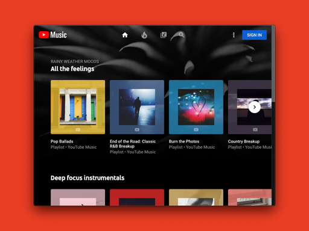
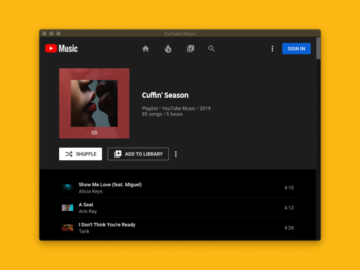
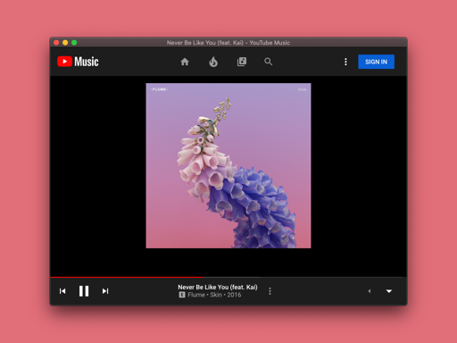

# Youtube Music

A cross platform desktop app for Youtube Music

## Getting Started

The app is based on electron

### Installing

Clone the repo then use,

```
$npm install
```

To start the app use,

```
$npm start
```

## Screenshots





## Built With

* [Electron](https://electronjs.org) - The web framework used for development of desktop GUI applications.

## Coming soon

* Notifications
* Keyboard playback shortcuts
* Performance optimizations

## Contributing

Please read [CONTRIBUTING.md](CONTRIBUTING.md) for details on our code of conduct, and the process for submitting pull requests to us.

## Authors

* **Abhishek Kashyap** - *Initial work* - [abhishekashyap](https://github.com/abhishekashyap)

## License

This project is licensed under the MIT License - see the [LICENSE.md](LICENSE.md) file for details